  

  

  
  
  

  

### 🗡️ About the adventurer

- 🎓 Computer science student at **UBT, Ferizaj campus**
- ⚙️ Full-stack developer, mostly **PostgreSQL · Express · React · Node.js**
- 🏰 Building **QiraPro**, a car rental aggregator for Kosovo, as lead developer
- 🌱 Currently leveling up: **Redis and real-time systems** (Docker is next)
- 📖 When I'm not coding, I write fiction
- 📫 Reach me at **albionhakiu@gmail.com**

  
   🔒 Private repository · in active development

  
  

<table align="center">
  <tr>
    <td align="center"><b>🔮 Languages</b></td>
    <td></td>
  </tr>
  <tr>
    <td align="center"><b>🛡️ Frontend</b></td>
    <td></td>
  </tr>
  <tr>
    <td align="center"><b>⚔️ Backend</b></td>
    <td></td>
  </tr>
  <tr>
    <td align="center"><b>📜 Databases</b></td>
    <td></td>
  </tr>
</table>

  

  
  
  
  
  
  
  
  

  

<!-- The serpent below is generated by .github/workflows/serpent.yml. Run it once from the Actions tab. -->

  <picture>
    <source media="(prefers-color-scheme: dark)" srcset="https://raw.githubusercontent.com/its-easybro/its-easybro/output/serpent-dark.svg" />
    
  </picture>

  Open to internships, junior roles and interesting collaborations. 
  <a href="mailto:albionhakiu@gmail.com"><b>albionhakiu@gmail.com</b></a> · <a href="https://www.linkedin.com/in/albion-hakiu-4501b1357/"><b>LinkedIn</b></a>

